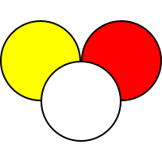

# CaromGenie



This is simple standalone webapplication for three cushion billiards game management. It has been created for various reasons:

## Why?

- Most point calculators are native apps with limited device support which has caused problems within our billiards community.
- To prove that it can be done _easily_
- It was facinating how minimal game state is required to drive the UI
- To have a meaningful hobby project for trying out some cool new tricks

Some extra features that were requested:

- Support for three players (Optional) ✅
- Possibility to pause the game ✅
- Shotclock extension ✅

## Tech

This is a [Next.js](https://nextjs.org/) project bootstrapped with [`create-next-app`](https://github.com/vercel/next.js/tree/canary/packages/create-next-app). Some extra packages has been added for maximum oomph!

### Getting Started

Install dependecies:

```bash
npm install
```

Running the development server:

```bash
npm run dev
```

Make static export (production build)

```bash
npm run build
```

### Getting involved

Fork, clone, do whatever you like; If you break it, you can keep all the pieces.

One can send in improvement ideas via normal GitHub channels e.g. PR:s or issues.

If you like what you see, please hit a star just to prove that someone visited.

## Future development

What _could_ be done in the future

- Sharing the state
  - Different UI for observing running game
- PWA support
- Statistics for game over screen
- "Raisa" support (in-house handicap system)
