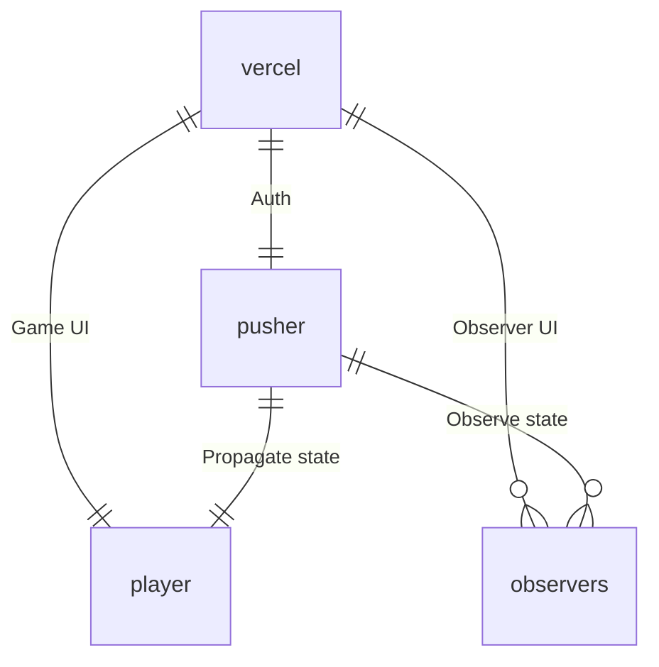

# Technology overview

UI is implemented with [Next.js](https://nextjs.org/) and [Typescript](https://www.typescriptlang.org/) e.g. it's a React app.

UI:s do not utilize fancy next app router features to their full potential, instead the Game UI "emulates" SPA with some extra
spicy :spaghetti:.

Server actions _are_ used, required for Pusher authentication.

Application runs in browser; No backend is required apart from websocket integration. No data is stored
in backend. Local storage is used for storing configuration settings and preferred theme.

## Birds eye view :turkey:

Service consists of two independent UI:s; one for actual score keeping which maintains the actual game state,
and one for observing running game. State is shared between the two via websockets. Observation UI is supposed
to be used for video overlays in case of live streaming of game events.

Both UI:s are served via [Vercel](https://vercel.com/) and websocket integration in handled by [Pusher](https://pusher.com/).
Service is non-profit and utilizes free-tier for both services.



Deployments are handled automatically by GitHub [integration](https://vercel.com/docs/deployments/git) provided by vercel.

## State

One of the driving factors for the project was to find feasible model for the [game state](src/store/schema.ts#L22-L29).

State is defined as [valibot](https://valibot.dev/) schema which is immensely cool :sunglasses:.

State management is done with custom React context.

## Websocket

Game UI is connected to Observer UI via websockets. This happens via Pusher. To make it work locally one needs to do some setup.

First, set up Pusher account / project with `Enable client events` on.

Then set some environment variables for configuring the connection. Most likely the easiest way for achieving this is to create
`.env.local` file in project root with following contents, you get the idea.

```
pusher_app_id = *****
NEXT_PUBLIC_pusher_key = *****
pusher_secret = *****
NEXT_PUBLIC_pusher_cluster = *****
```

Make sure to also set these up in the deployment environment.

## Styling

CSS is hand crafted with help of [Sass](https://sass-lang.com/) and it shows; no other fancy UI libraries are in use.

Achievement unlocked with themes even though they are not throughly polished :sunglasses:.

UI:s are somewhat responsive to support different screen sizes :iphone: / :computer:.
